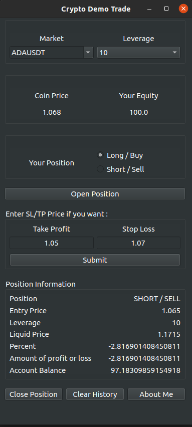

# Cryptocurrency Demo Trade Software
With this software, you can trade in digital currencies as a demo and gain experience.

The software stores your trading information in csv files. So you can close the software and come back to your trade later. You can trade in any number of digital currencies you want at the same time.



## Installtion
First install these packages:
```bash
sudo apt install python3-pip python3-venv python3-pyqt5
```

After downloading the software files, navigate to the project folder and:

```bash
python3 -m venv ./venv
source ./venv/bin/activate
pip install -r req.txt
```

and finally run it:

```bash
python3 main.py
```

Enjoy :)